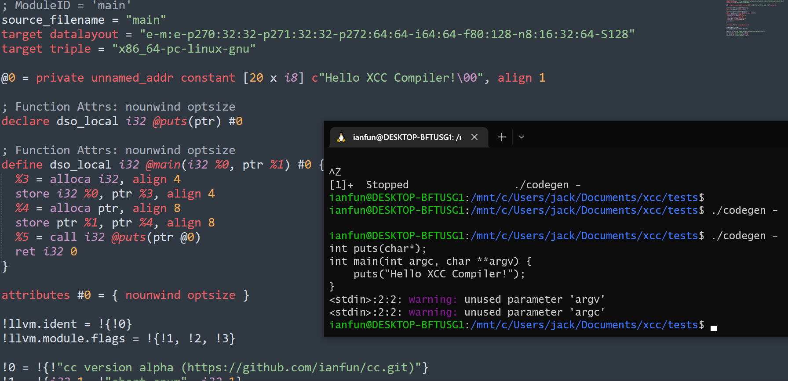
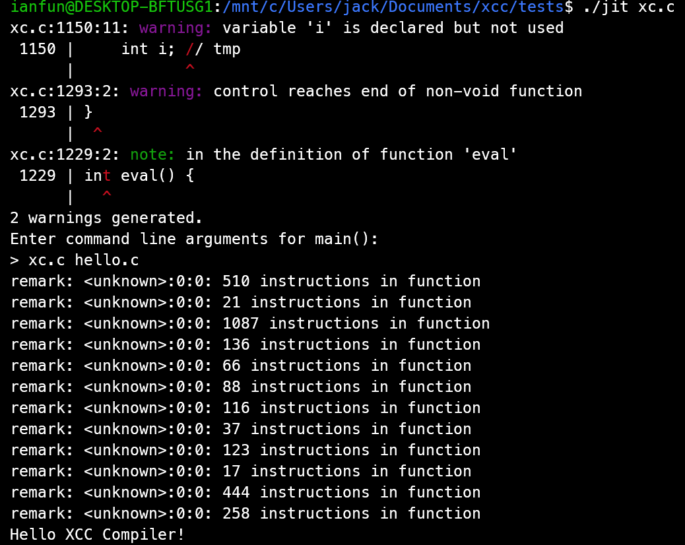
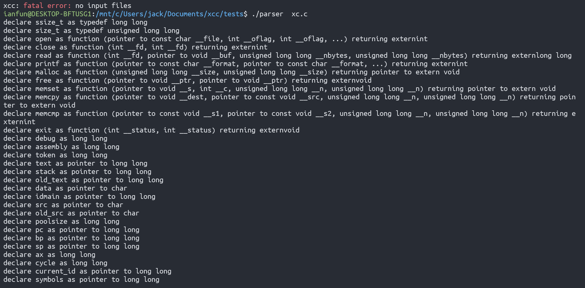
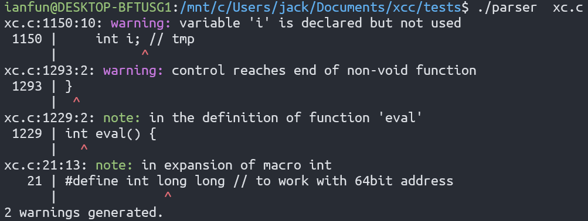
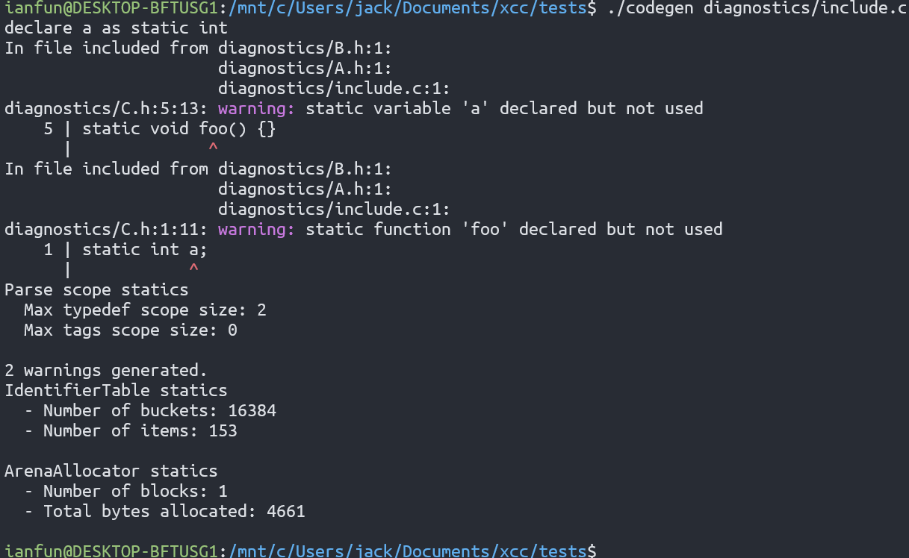
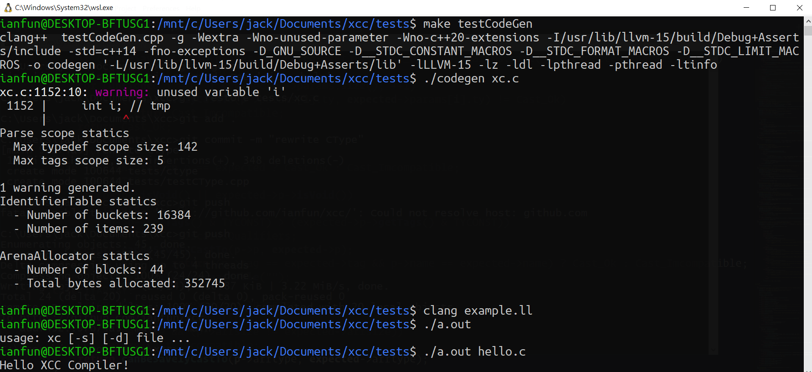
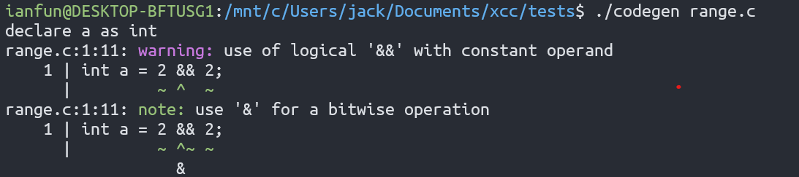
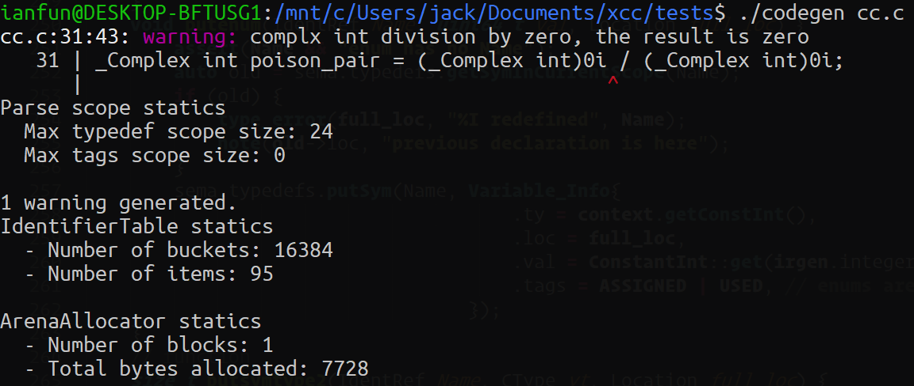

## The XCC C Compiler

A C23(C2X) C compiler.



## JIT

Just In Time Compilation demo



## Setting up your environment - Install LLVM

The main driver is tests/main.cpp.

XCC provides makefiles in tests directory.

In Windows, a MSYS2 installation is recommended for convenience(you can download binarys without building from source!).

you can install LLVM via

```bash
# MSYS2
$ pacman -S mingw-w64-x86_64-llvm
```

Also you install gdb debug tool.

```bash
$ pacman -S mingw-w64-x86_64-gdb
```

In Debian and Ubuntu, https://apt.llvm.org/ provides `llvm.sh` can help you install LLVM and Clang.

Or use apt

```bash
sudo apt install llvm-15
```

## Installing and Buliding

* Windows - MSYS2

Install LLD include headers and static libary files(.a)

```bash
$ pacman -S mingw-w64-x86_64-lld
```

Build XCC (assume you MSYS2 is installed in C:/msys64)

```bash
$ clang++ main.cpp -DCC_HAS_LLD -fno-exceptions -fno-rtti -D_FILE_OFFSET_BITS=64 -D__STDC_CONSTANT_MACROS -D__STDC_FORMAT_MACROS -D__STDC_LIMIT_MACROS C:/msys64/mingw64/lib/liblldWasm.a C:/msys64/mingw64/lib/liblldCOFF.a C:/msys64/mingw64/lib/liblldELF.a C:/msys64/mingw64/lib/liblldMachO.a C:/msys64/mingw64/lib/liblldMinGW.a C:/msys64/mingw64/lib/liblldCommon.a -lLLVM-15 -g C:/msys64/mingw64/bin/zlib1.dll
```

* Linux - GNU Make

Install LLD via apt/dpkg

```bash
$ sudo apt install liblld-15 liblld-15-dev
```

Or building from source

```bash
$ git clone https://github.com/llvm/llvm-project llvm-project
$ mkdir build
$ cd build
$ cmake -DCMAKE_BUILD_TYPE=Release -DLLVM_ENABLE_PROJECTS=lld -DCMAKE_INSTALL_PREFIX=/usr/local ../llvm-project/llvm
$ make install
```

Finally, build XCC with GNU make.

```bash
$ make
$ make main
$ make testLexer
$ make testCpp
$ make testParser
$ make testCodeGen
$ make all
$ make all -j
```

## Features

cdecl syntax



Expressive diagnostics



Include stack information



Supports Windows, WSL, Linux ...



Fix-it Hints



`_Complex`, `_Imaginary` support.



* trigraphs

Support trigraphs(both two and three charactors) in command line option `-trigraphs`.

## Author

ianfun

* 015006@mst.hlis.hlc.edu.tw
* ianfun.github.io@gmail.com

## References

* C23: https://open-std.org/JTC1/SC22/WG14/www/docs/n3054.pdf
