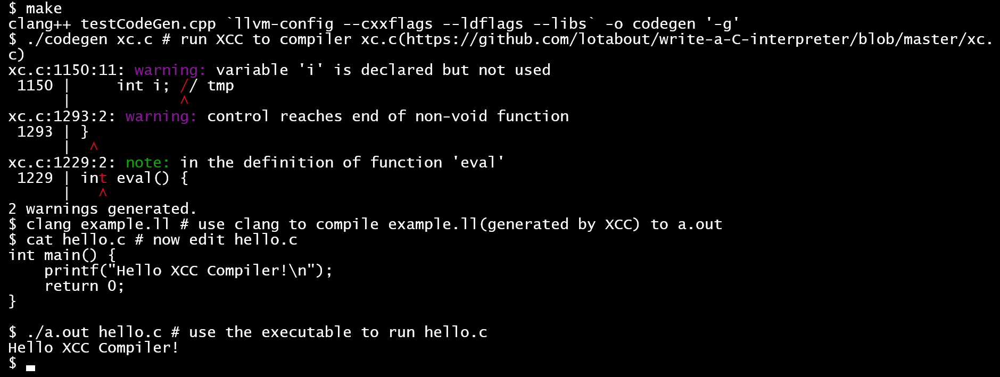

## The XCC Compiler

XCC is a Clang-like C compiler.



## JIT

Just In Time Compilation demo


## Building

The main driver is tests/main.cpp.

XCC provides makefiles in tests directory.

In Windows, a MSYS2 installation is recommended for convenience(you can download binarys without building them!).

you can install LLVM via

```bash
# MSYS2
$ pacman -S mingw-w64-x86_64-llvm
```

And install gdb

```bash
$ pacman -S mingw-w64-x86_64-gdb
```

In Debian and Ubuntu, https://apt.llvm.org/ provides `llvm.sh` can help you install LLVM and Clang.

Or use apt

```bash
sudo apt install llvm-15
```

## Linking

## Install lld linker 

* windows - MSYS2

install lld include files and object files

```bash
# MSYS2
$ pacman -S mingw-w64-x86_64-lld
```

build XCC (assume you MSYS2 is installed in C:/msys64)

```bash
$ clang++ main.cpp -DCC_HAS_LLD -fno-exceptions -fno-rtti -D_FILE_OFFSET_BITS=64 -D__STDC_CONSTANT_MACROS -D__STDC_FORMAT_MACROS -D__STDC_LIMIT_MACROS C:/msys64/mingw64/lib/liblldWasm.a C:/msys64/mingw64/lib/liblldCOFF.a C:/msys64/mingw64/lib/liblldELF.a C:/msys64/mingw64/lib/liblldMachO.a C:/msys64/mingw64/lib/liblldMinGW.a C:/msys64/mingw64/lib/liblldCommon.a -lLLVM-15 -g C:/msys64/mingw64/bin/zlib1.dll
```

(pretty long)

* linux - GNU Make

```bash
$ make
$ make main
$ make testLexer
$ make testCpp
$ make testParser
$ make testCodeGen
$ make all
$ make all -j
```
